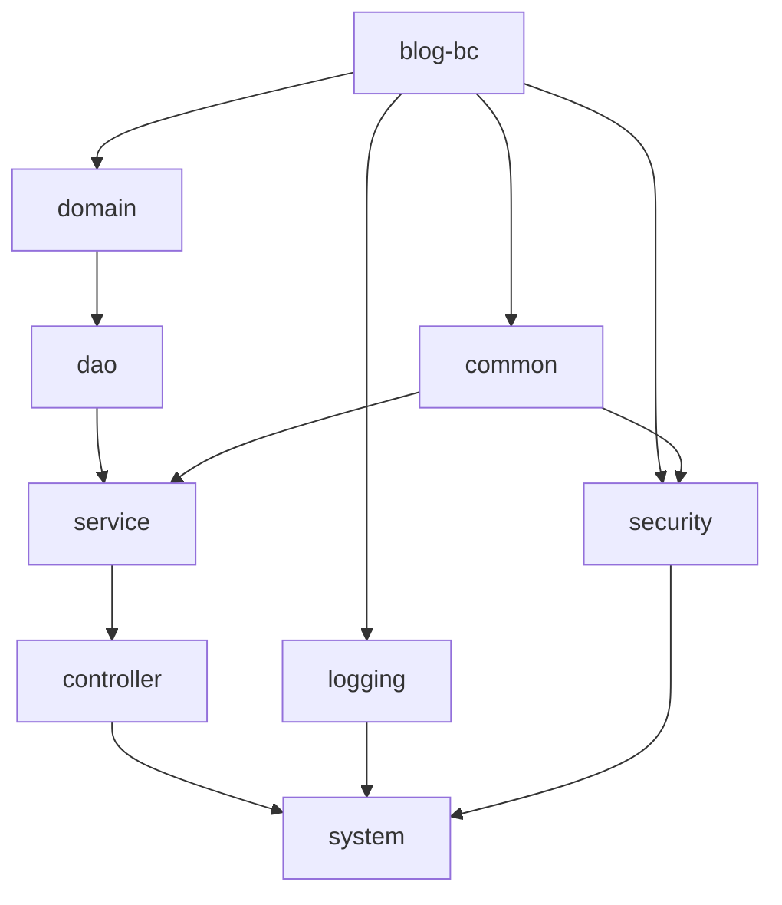

[toc]

# 一、模块分类

| 模块名          | 模块作用                                          |
| --------------- | ------------------------------------------------- |
| blog-lc         | 父类模块                                          |
| blog-common     | 为系统的公共模块                                  |
| blog-logging    | 为系统的日志模块                                  |
| blog-security   | 为系统的安全模块，拥有拦截机制                    |
| blog-domain     | 实体类模块                                        |
| blog-dao        | 数据访问层，对数据库进行访问；                    |
| blog-service    | 业务逻辑层，通过调用dao层来对数据库进行访问       |
| blog-controller | Controller控制器，调用service层方法实现与底层交互 |
| blog-system     | 为系统核心模块也是项目入口模块                    |

# 二、模块间的依赖关系

